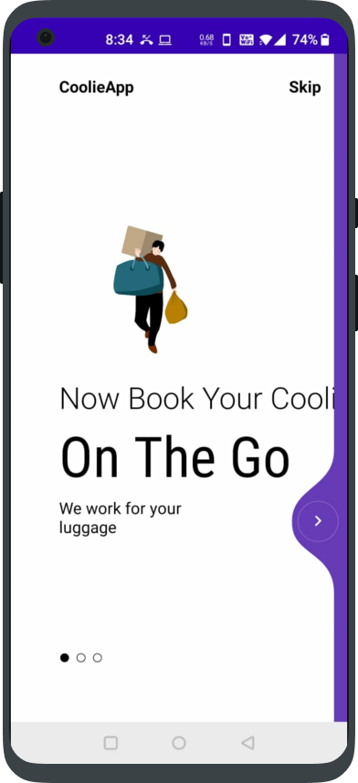
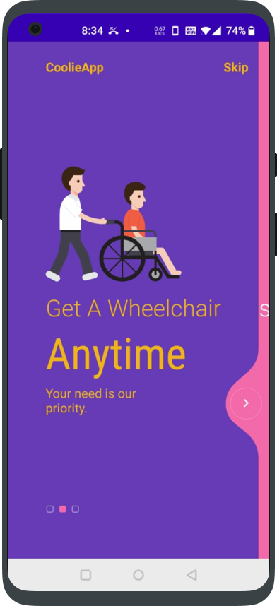
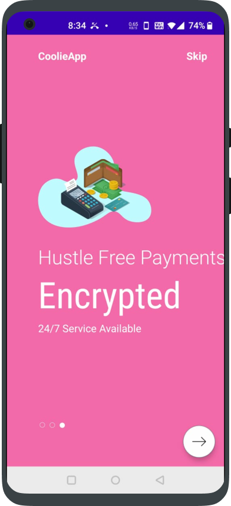
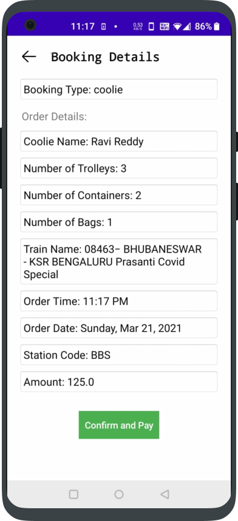
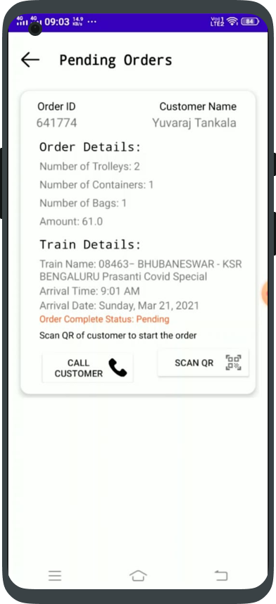
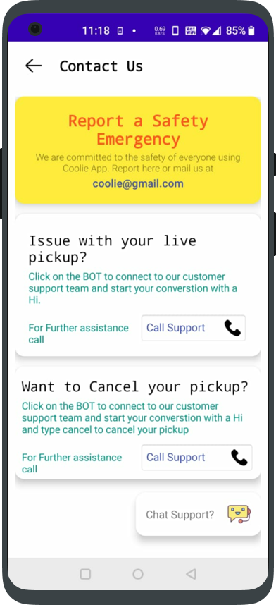

# Coolie App

### Button Dabao Coolie Bulao

<b>A full-stack app that makes the job of both coolie and user easier. Now any user can simply click the button to book a coolie without any hustle.</b>

# Project Demo

# Instructions to run application:

      1. Go Ahead and download the apk from the link below.
      
      2. Install the downloaded apk on your phone.

      3. Register yourself and experience the services. 

      4. To run the app in debug mode you need to do the following.
 
      5. Clone this repository on your desired directory.
      
      6. Head up to Android Studio and then Open an Exiting Project.
      
      7. Select this project directory and click on the run button.

# Key-Features

      1. A very simple user-friendly UI that can be handled easily by both coolie user.
      
      2. Dashboard for both Coolie and User.

      3. Coolie and Wheelchair booking at any railway station of India in just one click. 

      4. Handle all your orders in the all orders section.
 
      5. Check your PNR status within the app itself.
      
      6. Pay at your own convience through hustle free payment window.
      
      7. Check the authenticity of the customer by scanning his QR Code.

      8. Switch for the coolie to let himself choose when to take orders.

      9. Get in touch with the support using the telegram BOT.

      10. The app is completely available for all android versions starting from Android 5.0 to Android 10.0, satisfying 94.1 % of the whole world users.
 
 # Motivation for the project:

The pandemic has made us all learn many things. Whether it's studies, food ordering or jobs we all faced several challenges and the only help to us during this time was the internet. Whether we agree or not, the world is moving towards digitalization at a very rapid rate. Several services are getting digitalized. Thinking about the same we came up with an idea of why we can’t make our railway journeys much more easier, especially that part of the journey off the train. Think of how clumsy it gets when you're carrying huge luggages and searching for coolies everywhere in the station and then bargaining with them. The idea of our project is to save time and efforts for you by finding a coolie. You can now book your coolie before you even reach the station. If you are a patient or with disability you need not worry. We have got a service to book wheelchairs at railway stations which will be made ready for you before your arrival. On the other hand, this app benefits coolies and gets customers to them through one click of a button who otherwise had to literally run beside passengers to get a pickup. Currently the realization of the idea only contains baggage pickup and wheelchair services. But the idea doesn't stop here, in future we also think to add more services for both the users and coolie, using which they can benefit a lot. 

# Realization of the Project in the Modern India

With digitalization and the stablishment of free wifi and services at railway stations, we are moving towards the path of hightech railways stations. The availablity of 24/7 internet facility makes the task for the coolie easier. They just need a smartphone availability and they are all set to operate the services provided by the app.
Looking at many ongoing services outside the railway stations  like Swiggy, Zomato, Urban Clap, Uber, and Ola we feel that someday it's possible to get a facility like these into the stations as well.

# Tech stack and Modules used:

        App: Java, XML, Firebase(Real-time Database, Authentication, Cloud Messaging).
        
        Payment Gateway: RazorPay
        
        Tools Used: Android Studio and Postman
        
        Libraries Used: Retrofit, OkHttp, LottieFiles, Material.io
        
        API Used: Fast-API and Google FCM API
        
        Architecture: MVVM
        
        Landing Page : HTML, CSS, Javascript
        
# ScreenShots

### Splash Screen and On Boarding parts
   

### User Dashboard and features
   

### Other features
   

### Coolie Dashboard and features
  

# Links:
* [Download App](https://drive.google.com/file/d/18ht1HC51PrYMc1J1ALRM5BfZOIOy_N8n/view?usp=sharing)

* [View Video](https://youtu.be/s6y09lJDlaM)

* [View Landing Page](https://moit-bytes.github.io/Filling_Gaps/)

* [Backend](https://github.com/moit-bytes/Filling_Gaps/tree/main/Backend-FastAPI)

## Contributors ✨

Reach out to us, if you liked this :)
<table>
  <tr>
    <td align="center"><a href="https://github.com/moit-bytes"> <b>Mohit Kumar</b></a> </td>
    <td align="center"><a href="https://github.com/yuvaraj-06"> <b>Yuvaraj T</b></a> </td>
</table>
